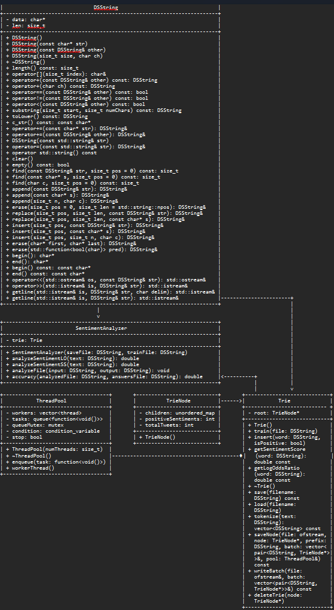

# Assignment 2: Answers

**Complete this document, commit your changes to Github and submit the repository URL to Canvas.** Keep your answers short and precise.

Your Name: Craig Truitt

Used free extension: [ ] 24 hrs or [ ] 48 hrs

[x] Early submission (48 hrs)

[x] Bonus work. Describe: 72% accuracy

Place [x] for what applies.

## UML Diagram

## Answers

1. How do you train the model and how do you classify a new tweet? Give a short description of the main steps.

   > ### Model Creation and Training:
   > 1. **Initialization**:
   >    - Created an instance of the `SentimentAnalyzer` class, passing the file paths for saving the trained model (`trie.dat`) and the training dataset (`train_dataset_20k.csv`).
   >
   > 2. **Loading or Training the Trie**:
   >    - In the `SentimentAnalyzer` constructor, attempted to load the Trie from the `trie.dat` file.
   >    - If the file was not found or was empty, trained the Trie using the `train_dataset_20k.csv` file.
   >    - The training process involved reading the training file line by line, tokenizing the tweets, and inserting the words into the Trie with their corresponding sentiment values.
   >
   > 3. **Saving the Trie**:
   >    - After training, saved the Trie to the `trie.dat` file for future use.
   >
   > ### Classifying a New Tweet:
   > 1. **Tokenization**:
   >    - Tokenized the new tweet into individual words using the `tokenize` method of the `Trie` class.
   >
   > 2. **Sentiment Analysis**:
   >    - Analyzed the sentiment of the tweet using two methods:
   >      - **Log-Odds Ratio (LO)**: The `analyzeSentimentLO` method calculated the log-odds ratio for each word in the tweet and summed them up.
   >      - **Sentiment Score (SS)**: If the log-odds ratio was zero, the `analyzeSentimentSS` method calculated the sentiment score for each word in the tweet and summed them up.
   >
   > 3. **Classification**:
   >    - Adjusted the overall sentiment score by adding 0.2.
   >    - Classified the sentiment as positive (4) if the score was greater than 0, negative (0) if less than 0, and neutral (2) if equal to 0.
   >
   > 4. **Output**:
   >    - Wrote the sentiment, tweet ID, and sentiment score to the output file.

   This process allowed me to train a sentiment analysis model using a Trie data structure and classify new tweets based on the trained model.

2. How long did your code take for training and what is the time complexity of your training implementation (Big-Oh notation)? Remember that training includes reading the tweets, breaking it into words, counting, ... Explain why you get this complexity (e.g., what does `N` stand for and how do your data structures/algorithms affect the complexity).

   > ### Training Time and Complexity
   > 
   > #### Training Time
   > - Training my code took 0.313085 seconds.
   > - To make things more efficient, I saved it for later use.
   >    - Saving took 0.301077 seconds.
   >    - Loading it again took 0.0554828 seconds.
   >
   > #### Time Complexity (Big-Oh Notation)
   > The time complexity of the training implementation is as follows:
   >
   > - Reading the tweets: This operation is O(N), where N is the number of tweets.
   > - Breaking tweets into words: This operation is O(M), where M is the total number of words across all tweets.
   > - Counting words: This operation is O(M), where M is the total number of words.
   >
   > ##### Explanation
   > - N stands for the number of tweets.
   > - M stands for the total number of words across all tweets.
   >
   > The data structures and algorithms used affect the complexity as follows:
   > - Reading tweets involves iterating through each tweet, hence O(N).
   > - Breaking tweets into words involves iterating through each word in each tweet, hence O(M).
   > - Counting words involves maintaining a count for each word, which is also O(M).
   >
   > Overall, the training process has a time complexity of O(N + M).

3. How long did your code take for classification and what is the time complexity of your classification implementation (Big-Oh notation)? Explain why.

   > The classification process took 0.288002 seconds. 
   >
   > ### Time Complexity Analysis
   >
   > The time complexity of the classification implementation can be broken down into several parts:
   >
   > 1. **Tokenization**: 
   >     - The `tokenize` function processes each character of the input text to split it into words. This operation is \(O(n)\), where \(n\) is the length of the input text.
   >
   > 2. **Sentiment Analysis**:
   >     - For each word in the tokenized text, the sentiment score or log-odds ratio is calculated using the Trie. 
   >     - The Trie operations (insertion, search) typically have a time complexity of \(O(m)\), where \(m\) is the length of the word. 
   >     - If there are \(k\) words in the text, the total time complexity for sentiment analysis would be \(O(k \cdot m)\).
   >
   > 3. **File I/O**:
   >     - Reading from and writing to files involves I/O operations, which can vary in complexity based on the file size and system performance. However, these operations are generally considered \(O(n)\) for reading and writing \(n\) characters.
   >
   > ### Overall Time Complexity
   >
   > Combining these parts, the overall time complexity for classifying a single text can be approximated as:
   \[ O(n) + O(k * m) \]
   >
   > Where:
   > - \(n\) is the length of the input text.
   > - \(k\) is the number of words in the text.
   > - \(m\) is the average length of the words.
   >
   > Given that \(k\) and \(m\) are typically much smaller than \(n\), the dominant term is \(O(n)\). Therefore, the overall time complexity can be approximated as \(O(n)\).

### Explanation

The classification process is efficient due to the use of the Trie data structure, which allows for fast word lookups. The linear time complexity \(O(n)\) ensures that the classification can handle large texts efficiently, as demonstrated by the 0.288002 seconds it took for the classification in your case.

4. What accuracy did your algorithm achieve on the provides training and test data? 

   > My accuracy: 72.000% (Note: This is exactly 72%. You can check this by looking at mistakes.csv)

   The TA will run your code on Linux and that accuracy value will be used to determine your grade.

5. What were the changes that you made that improved the accuracy the most?
   
   > The first time I got my code to work, it ran at 69% accuracy. From there, the biggest changes occurred when I weighted my data points and when I applied the +0.2 shift. I applied the +0.2 shift when I made the mistakes.csv and saw that ~90% of my misidentifications were false negatives. I believe that this is because there are fewer negative words than positive words. Thus, when trained linearly on a balanced dataset and weighted by certainty, the negative words overpowered the positive ones when they occured.

6. How do you know that you use proper memory management? I.e., how do you know that you do not have
   a memory leak?

   > I am confident that I used proper memory management because I used delete for every time I used new, and I made sure the logic was accurate regarding the deletion of unnecessary pointers.

6. What was the most challenging part of the assignment?

   > The most challenging part of the assignment for me was moving my accurracy from 69% to 72%. Using a lexicon-based approach like I did is very limited with optimal success when context is not considered significantly. As a result, many of my efforts to boost my percentage did nearly nothing.