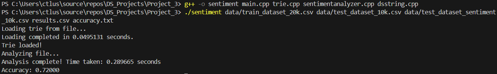

# Design Documentation

## Overview

This document provides an in-depth design overview of the sentiment analysis project. The project consists of several classes and modules that work together to train a sentiment analysis model using a Trie data structure and classify new tweets based on the trained model.

## Output

## Class Descriptions

### 1. `SentimentAnalyzer`

#### Purpose:
The `SentimentAnalyzer` class is responsible for training the sentiment analysis model, analyzing the sentiment of text data, and calculating the accuracy of the analysis.

#### Key Methods:
- **Constructor**: Initializes the `SentimentAnalyzer` object, loads or trains the Trie, and saves the trained Trie.
- **analyzeSentimentLO**: Analyzes sentiment using the log-odds ratio method.
- **analyzeSentimentSS**: Analyzes sentiment using the sentiment score method.
- **analyzeFile**: Analyzes the sentiment of text data in a file and writes the results to an output file.
- **accuracy**: Calculates the accuracy of the sentiment analysis by comparing the analyzed file with the answers file.

### 2. `Trie`

#### Purpose:
The `Trie` class represents a Trie (prefix tree) data structure used for storing and analyzing words with sentiment scores.

#### Key Methods:
- **Constructor**: Initializes the Trie.
- **train**: Trains the Trie with words from a file.
- **insert**: Inserts a word into the Trie with its sentiment.
- **getSentimentScore**: Gets the sentiment score of a word.
- **getLogOddsRatio**: Gets the log-odds ratio of a word.
- **save**: Saves the Trie to a file.
- **load**: Loads the Trie from a file.
- **tokenize**: Tokenizes a text into words.

### 3. `TrieNode`

#### Purpose:
The `TrieNode` class represents a node in the Trie data structure.

#### Key Members:
- **children**: An unordered map to hold children nodes.
- **positiveSentiments**: Counter for positive sentiments.
- **totalTweets**: Counter for total tweets.

### 4. `ThreadPool`

#### Purpose:
The `ThreadPool` class manages and executes tasks using multiple threads.

#### Key Methods:
- **Constructor**: Initializes the thread pool with a specified number of threads.
- **Destructor**: Cleans up resources used by the thread pool.
- **enqueue**: Adds a task to the task queue to be executed by the thread pool.
- **workerThread**: Method for worker threads to execute tasks from the task queue.

### 5. `DSString`

#### Purpose:
The `DSString` class is a custom string class that provides various string manipulation functionalities.

#### Key Methods:
- **Constructors**: Initializes the `DSString` object from C-strings, other `DSString` objects, or standard strings.
- **Destructor**: Releases allocated memory.
- **length**: Returns the length of the string.
- **operator[]**: Subscript operator to access characters.
- **operator+**: Concatenation operators.
- **operator==**: Equality operator.
- **substring**: Extracts a substring.
- **toLower**: Converts the string to lowercase.
- **c_str**: Returns a C-string representation of the `DSString`.

## Workflow

### Training the Model
1. **Initialization**: Create an instance of the `SentimentAnalyzer` class, passing the file paths for saving the trained model and the training dataset.
2. **Loading or Training the Trie**: In the `SentimentAnalyzer` constructor, attempt to load the Trie from the save file. If the file is not found or is empty, train the Trie using the training dataset.
3. **Saving the Trie**: After training, save the Trie to the save file for future use.

### Classifying a New Tweet
1. **Tokenization**: Tokenize the new tweet into individual words using the `tokenize` method of the `Trie` class.
2. **Sentiment Analysis**: Analyze the sentiment of the tweet using the `analyzeSentimentLO` and `analyzeSentimentSS` methods.
3. **Classification**: Adjust the overall sentiment score and classify the sentiment as positive, negative, or neutral.
4. **Output**: Write the sentiment, tweet ID, and sentiment score to the output file.

### Calculating Accuracy
1. **Comparison**: Compare the analyzed file with the answers file to determine the accuracy of the sentiment analysis.
2. **Output**: Write the accuracy results to the specified file.

## Conclusion

This design documentation provides an overview of the key classes and methods used in the sentiment analysis project. The project leverages a Trie data structure for efficient sentiment analysis and a thread pool for parallel processing. The `SentimentAnalyzer` class orchestrates the training, classification, and accuracy calculation processes, ensuring a robust and efficient sentiment analysis solution.